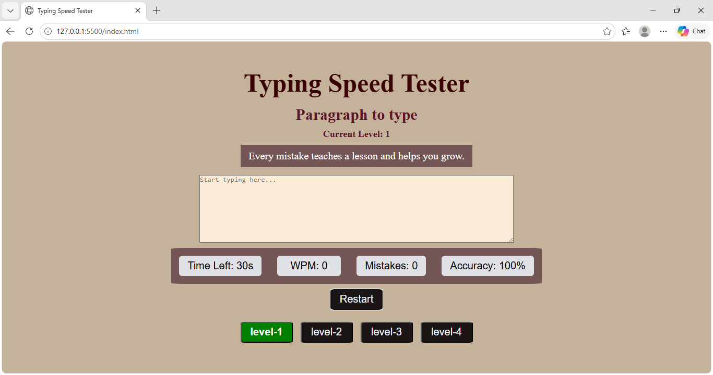

# ⌨️ Typing Speed Tester

A modern and interactive Typing Speed Tester built using **HTML, CSS, and JavaScript**. This project helps users improve their typing speed and accuracy through multiple difficulty levels, countdown timers, and real-time performance tracking.

---

## 🚀 Features

✅ Multiple Difficulty Levels

- Level 1 (Easy)
- Level 2 (Beginner)
- Level 3 (Intermediate)
- Level 4 (Advanced)

✅ Random Paragraph Generation

- Different paragraphs for each level
- Meaningful and motivational content

✅ Real-Time Statistics

- ⏳ Countdown Timer
- ⚡ Words Per Minute (WPM)
- 🎯 Accuracy Percentage
- ❌ Mistake Counter

✅ User-Friendly Features

- Restart Test
- Paragraph Completion Detection
- Time Up Detection
- Active Level Highlighting
- Responsive Design

---

## 📸 Preview

---

## 🛠️ Technologies Used

- HTML5
- CSS3
- JavaScript (ES6)

---

## Live Demo
- https://laxmijalikatti.github.io/Typing_Speed_Tester/

## 📚 Concepts Practiced

This project helped me practice:

- DOM Manipulation
- Event Listeners
- Functions
- Arrays
- Loops
- Conditional Statements
- setInterval()
- Random Data Selection
- String Comparison
- Responsive Web Design

---

## 🎮 How It Works

1. Select a difficulty level.
2. A random paragraph is displayed.
3. Start typing in the text area.
4. Timer starts automatically.
5. WPM, Accuracy, and Mistakes are calculated in real time.
6. Complete the paragraph before time runs out.
7. Use the Restart button to try again.

---

## 📈 Difficulty Levels

| Level | Time | Difficulty |
|---------|---------|---------|
| Level 1 | 30 sec | Easy |
| Level 2 | 45 sec | Beginner |
| Level 3 | 60 sec | Intermediate |
| Level 4 | 90 sec | Advanced |

---

## 💡 Future Improvements

- Dark Mode
- Leaderboard
- Sound Effects
- Typing History
- High Score Storage using Local Storage
- Custom Paragraph Upload
- Multiplayer Typing Challenge

---

## 👩‍💻 Author

**Laxmi Jalikatti**

- Computer Science Engineering Student
- Aspiring Software Developer
- DSA Enthusiast
- Web Development Learner

### Connect with Me

- GitHub: https://github.com/LaxmiJalikatti
- LinkedIn: https://www.linkedin.com/in/laxmi-jalikatti-2590a332a/

---

⭐ If you like this project, consider giving it a star!
